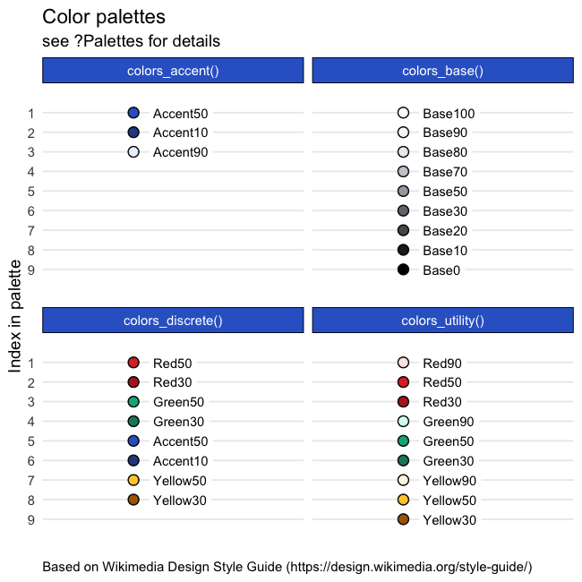

# wmfdata: R tools for Wikimedia Foundation's Analysts & Data Scientists

**NOTICE**: while this package is installed from GitHub ([wikimedia/wmfdata-r](https://github.com/wikimedia/wmfdata-r)), that repository is a read-only mirror of [wikimedia/discovery/wmf](https://gerrit.wikimedia.org/g/wikimedia/discovery/wmf) repository hosted on [Gerrit](https://www.mediawiki.org/wiki/Gerrit). See [mediawiki:Developer account](https://www.mediawiki.org/wiki/Developer_account) for information about creating a Wikimedia Developer account for contributing to this package, MediaWiki, and other Wikimedia projects.

Other packages from [Wikimedia Foundations's Product Analytics team](https://www.mediawiki.org/wiki/Product_Analytics) include [wmfdata](https://github.com/wikimedia/wmfdata-python) for working with Wikimedia data in Python, and [waxer](https://github.com/wikimedia/waxer) for querying Wikimedia Analytics Query Service in R, and [wmfastr](https://github.com/wikimedia/wmfastr) for speedy dwelltime and search preference metrics calculations in R.

## Installation

```R
# install.packages("remotes", repos = c(CRAN = "https://cran.rstudio.com/"))
remotes::install_github("wikimedia/wmfdata-r")
```

To update:

```R
remotes::update_packages("wmfdata")
```

## Highlights

- `set_proxies` to set http(s) proxies on the analytics cluster
- `global_query` for querying all of our MySQL databases
- Utilities for working with logs, including EventLogging data:
  - `from_mediawiki` and `from_log` (and corresponding `to_*` functions) to convert between time formats
- `query_hive` for querying our Hadoop cluster via Hive
- `mysql_read` for querying our MariaDB databases
  - uses automatic shard detection, see `?connection_details` for more info
- Sample size calculations:
    - `chisq_test_odds` estimates sample size for a chi-squared test given an odds ratio
    - `chisq_test_effect` estimates sample size for a chi-squared test given Cohen's *w*

Also includes [Wikimedia Design visual style colors](https://design.wikimedia.org/style-guide/visual-style_colors.html):



## Maintainers

- [Mikhail Popov](https://meta.wikimedia.org/wiki/User:MPopov_(WMF))

## Additional Information

Please note that this project is released with a [Contributor Code of Conduct](CONDUCT.md). By participating in this project you agree to abide by its terms.
